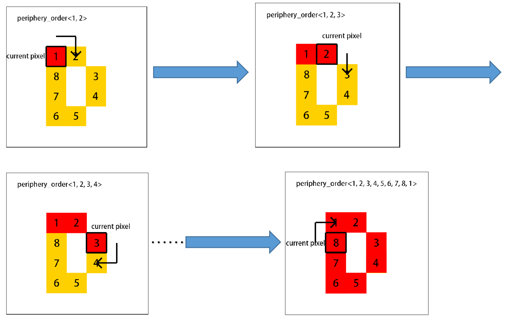
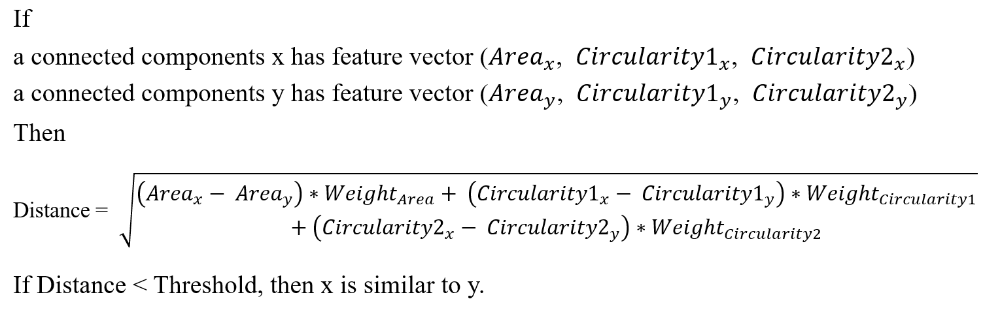
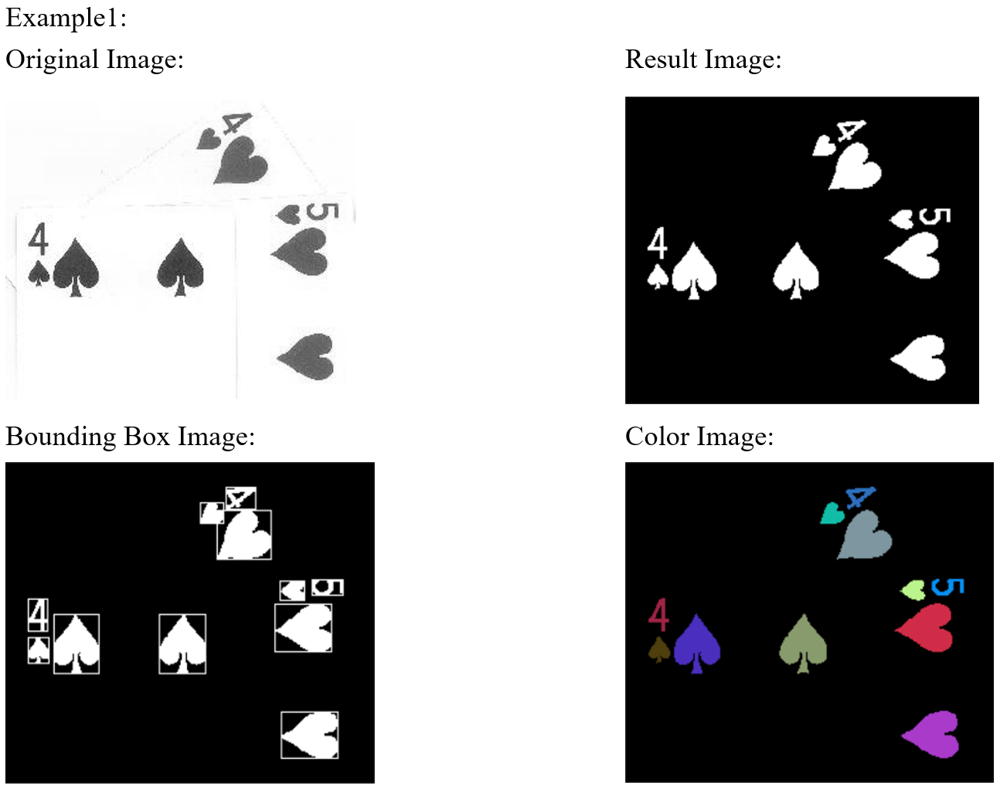
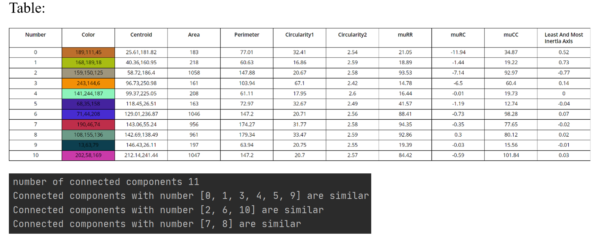
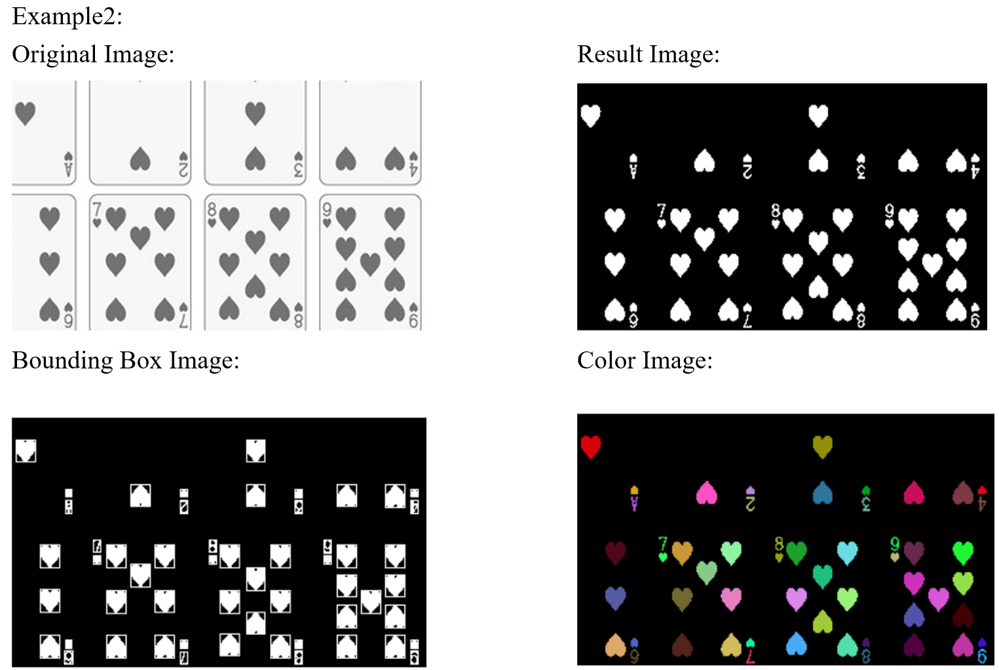
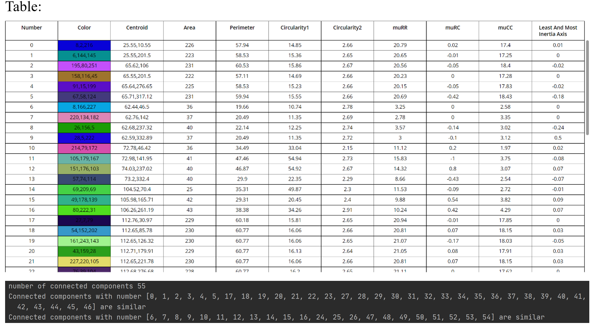

# Connected Components Labeling For Image Analysis

## 1. About This Project

The objective of this project is to gain experience with connected components analysis, morphological filters, and the use of features for recognition of objects. A secondary objective is to gain experience with image formats.

## 2. Brief Problem Definition

In this project, a connected components program is implemented with all the function that listed in the requirements. This program aims to practice skills with connected components analysis, morphological filters, and the use of features for recognition of objects.

## 3. Summary Of Choices Made For The Solution

To get the connected components, I use two pass algorithm and union-find data structure.

### 3.1 Union-Find
I use an array named ‘parent’ to store sets of equivalent labels in a tree. In the ‘parent’ array, the subscripts are possible labels and values are the labels of ‘parent’ nodes.

About the union-find there are two functions which are Find and ‘Union’. The ‘Find’ function utilizing the ‘parent’ array, searches the root of one label and returns the root. The ‘Union’ function merges two sets containing the given label x and the given label y and then modifies the ‘parent’ array.

### 3.2 Two Pass Algorithm

The first pass is to assign temporary labels to each non-zero pixel based on its up and left neighbors. If it has two different labeled neighbors, then assign the pixel with a smaller value and use the ‘Union’ function to establish a relation between two neighbors. Then use the ‘parent’ array to record equivalences. The second pass to replace each temporary label with the smallest label of its equivalence class using the ‘Find’ function.

### 3.3 Compute Perimeter Algorithm
#### 3.3.1 Find Peripheral Pixels
Firstly, a list that is defined as [[-1, 0], [0, 1], [1, 0], [0, -1]] is used to find whether peripheral pixels of each tested pixel are all in the connected components. If not, the tested pixel is peripheral.

#### 3.3.2 Generate Ordered Sequence
The upper left pixel is used as our original ‘current pixel’ at the beginning. Then find the next pixel in the clockwise direction. The ‘current pixel’ is the center of the clockwise rotation search. When the next pixel is found, the new found pixel would replace the old ‘current pixel’ and the algorithm would continue to find the new next pixel. The algorithm would not stop until the original start pixel is found. Finally the array ‘periphery_order’ forms. I traverse the sequence of the ‘periphery_order’ and accumulate the distance of each neighbor pixel to get the perimeter of a connected component.

  
#### 3.3.3 Algorithm of Identifying Similar Connected Components
To find which connected components are similar, I can set some feature vectors and calculate the distance between the feature vectors. If the distance is less than a threshold, then the connected components are similar, otherwise not.

## 4. Two Example Images And Results Of Running The Program On Them

### 4.1 Example1

### 4.2 Example2

## 5. Brief Discussion Of Results

This program can find objects in the images and extract the main features of the images to determine what similar objects are. This program is implemented with all the functions and features described in the requirements. Only the given image format which are .pgm, .pbm, and .ppm is allowed in this program. Moreover, this program computes features of each connected component including area, perimeter, centroid, circularity1, circularity2, bounding box, second moments, and angle of the axis of least inertia, and uses feature vectors to identify similar connected components.
Shortcomings: the algorithm for identifying similar connected components is a little simple and not too accurate. The algorithm for calculating the perimeter is time-consuming. 
