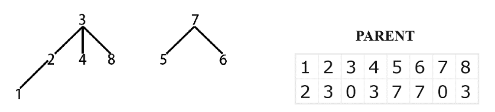

# Connected Components Labeling for Image Analysis

## About This Project

The objective of this project is to gain experience with connected components analysis, morphological filters, and the use of features for recognition of objects. A secondary objective is to gain experience with image formats.

## Brief Problem Definition

In this project, a connected components program is implemented with all the function that listed in the requirements. This program aims to practice skills with connected components analysis, morphological filters, and the use of features for recognition of objects.

## Summary Of Choices Made For The Solution

To get the connected components, I use two pass algorithm and union-find data structure.

# Union-Find
I use an array named ‘parent’ to store sets of equivalent labels in a tree. In the ‘parent’ array, the subscripts are possible labels and values are the labels of ‘parent’ nodes.

## Two Example Images And Results Of Running The Program On Them

*Before and after processing of image 1, illustrating connected components labeling.*

*Before and after processing of image 2, showcasing object recognition and feature calculation.*

## Brief Discussion Of Results

The results demonstrate the program's capability to accurately identify and label connected components within complex images. The use of morphological filters significantly improved the clarity of object boundaries, while the two-pass algorithm ensured efficient labeling. Feature calculations enabled detailed analysis of each identified object, facilitating robust object recognition. These outcomes highlight the tool's potential in various applications, from academic research to practical image processing tasks.

---

For more details on the project setup, usage instructions, and contributions, please refer to the subsequent sections of this README.
