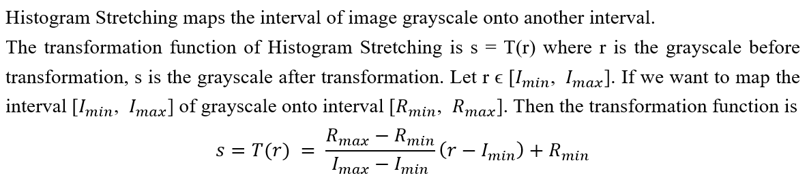

# Image Enhancement, Smooth and Edge Detector

## 1. Introduction
In this program, image enhancement techniques, image smooth techniques, and edge detectors are implemented to do the image process for 3 given images. This program aims to practice image processing skills and find the best strategy to improve and detect the edges of the given image MRI.pgm with the implemented image processing functions.

## 2. Implementation

### 2.1 Image Enhancement Techniques

#### 2.1.1 Histogram Stretching

#### 2.1.2 Power Law

#### 2.1.3 Logarithm

#### 2.1.4 Histogram Equalization

### 2.2 Image Smooth Techniques

#### 2.2.1 Mean Filter

#### 2.2.2 Median Filter

#### 2.2.3 Gussian Filter

### 2.3 Edge Detector

#### 2.3.1 Canny

#### 2.3.2 Marr Hidreth

#### 2.3.3 Sobel

#### 2.3.4 Laplacian

### 2.4 GUI

## 3. Experiment

## 4. Conclusion

### 4.1 Discussion

### 4.2 Result

