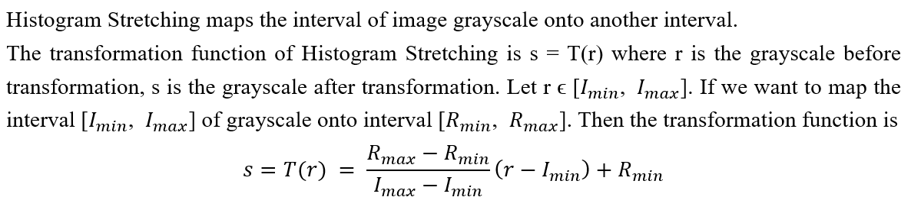

# Image Enhancement, Smooth and Edge Detector

## 1. Introduction
In this program, image enhancement techniques, image smooth techniques, and edge detectors are implemented to do the image process for 3 given images. This program aims to practice image processing skills and find the best strategy to improve and detect the edges of the given image MRI.pgm with the implemented image processing functions.

## 2. Implementation

### 2.1 Image Enhancement Techniques

#### 2.1.1 Histogram Stretching

#### 2.1.2 Power Law

#### 2.1.3 Logarithm

#### 2.1.4 Histogram Equalization
Histogram equalization is a method in image processing of contrast adjustment using the image's histogram.

### 2.2 Image Smooth Techniques

#### 2.2.1 Mean Filter
The mean filter is a simple sliding-window spatial filter that replaces the center value in the window with the average (mean) of all the pixel values in the window. The window, or kernel, is usually square but can be any shape.

#### 2.2.2 Median Filter
The median filter is also a sliding-window spatial filter, but it replaces the center value in the window with the median of all the pixel values. As for the mean filter, the kernel is usually square but can be any shape.

#### 2.2.3 Gaussian Filter
The Gaussian filter is the spatial filter used to remove Gaussian noise in the image. Specifically, it uses a two-dimensional Gaussian distribution to generate an average mask to remove Gaussian noise and smooth the image.

### 2.3 Edge Detector

#### 2.3.1 Canny
The Canny edge detection algorithm is a multi-stage process to detect a wide range of edges in images. It can be broken down into five different steps:
1. Apply a Gaussian filter to smooth the image to remove the noise.
2. Find the intensity gradients of the image by using Sobel Filter.
3. Apply Non-Maximum Suppression to find which pixels are the maximum in the gradient direction.**

4. Apply a double threshold to determine potential edges.
5. Track edge by hysteresis: Finalize the detection of edges by suppressing all the other edges that are weak and not connected to strong edges(using Depth-First-Search to find the weak edges which are connected to strong edges).

The process is following:
1. Prepare a stack S, and a queue Q, and set the Connected indicator variable to false. Start at the first pixel in the image and go to 2.
2. If the pixel is the weak edge pixel and unmarked, mark it and put it as the first element in the stack S, and also put it in the queue Q, which records the connection curve, and enter 3. If the pixel is not a weak boundary pixel or has already been marked, go to the next pixel in the image and repeat 2.
3. Take an element from the stack S and look for its 8-pixel field. If a field pixel is weak and unmarked, mark the field pixel and add it to stack S and queue Q. At the same time, find the strong boundary graph corresponding to the domain. If one pixel is a strong boundary pixel, it means that the weak boundary curve is connected to the strong boundary. Set Connected to True. Repeat 3 until the stack runs out of elements. If Connected is false, each element in turn is fetched from queue Q, clearing the tag. If Connected is true, keep the flag.
4. Clear the queue Q, set Connected to false, and move to the next pixel in the image, go to 2.

#### 2.3.2 Marr Hidreth
The Process of Marr Hidreth edge detection algorithm can be broken down into 3 different steps: 
1. Apply a Gaussian filter to smooth the image to remove the noise. 
2. Apply the Laplacian of the Gaussian filter to approximate a second derivative measurement on the image.
3. Find Zero-Crossing pixels on the image to obtain the edges.

#### 2.3.3 Sobel
The Sobel filter is used to detect the edges of the image. Specifically, it uses two filters to detect horizontal and vertical edges. Then merge two edges and map all values of edges to 0~255.

#### 2.3.4 Laplacian
Laplacian is a kind of differential operator, its application can enhance the region of sudden grayscale changes in the image, and weaken the slow-changing area of grayscale.

### 2.4 GUI
Use Tkinter to construct the GUI system. The main window(right) contains functions users can use(4 image enhancement functions, 3 image smooth functions, and 4 edge detector functions) and record the image process(lower-right of the main window). Users can also choose and reset images in the main window. The sub-window(left) shows the image. The screenshots are as follows:

## 3. Experiment
The first step is to apply image enhancement to the MRI.pgm given the 4image enhancement functions.

After the image enhancement, histogram stretching and histogram equalization have better performance. The second step is to apply the median filter to reduce noise since noise would make errors in the edge detector. The final step is applying an edge detector to the processed images. The images which are enhanced by histogram stretching and detected by 4 edge detectors are as follows:

The images which are enhanced by histogram equalization and detected by 4 edge detectors are as follows:

## 4. Conclusion
### 4.1 Discussion
The best strategy to improve and detect the edges of image MRI.pgm is to use histogram stretching to do the image enhancement. Then twice the median filter to remove the noise. Finally applying the canny edge detector to do the edge detection. The final image is like this:

### 4.2 Result of Other Images

