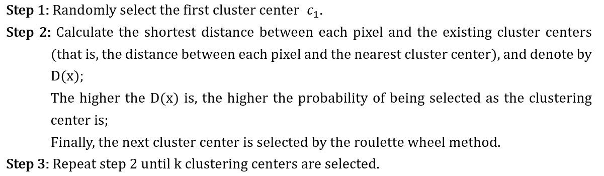
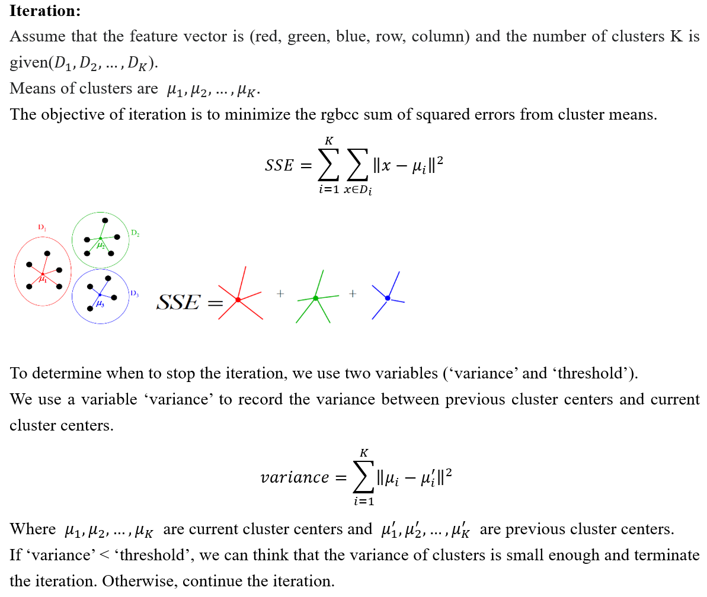
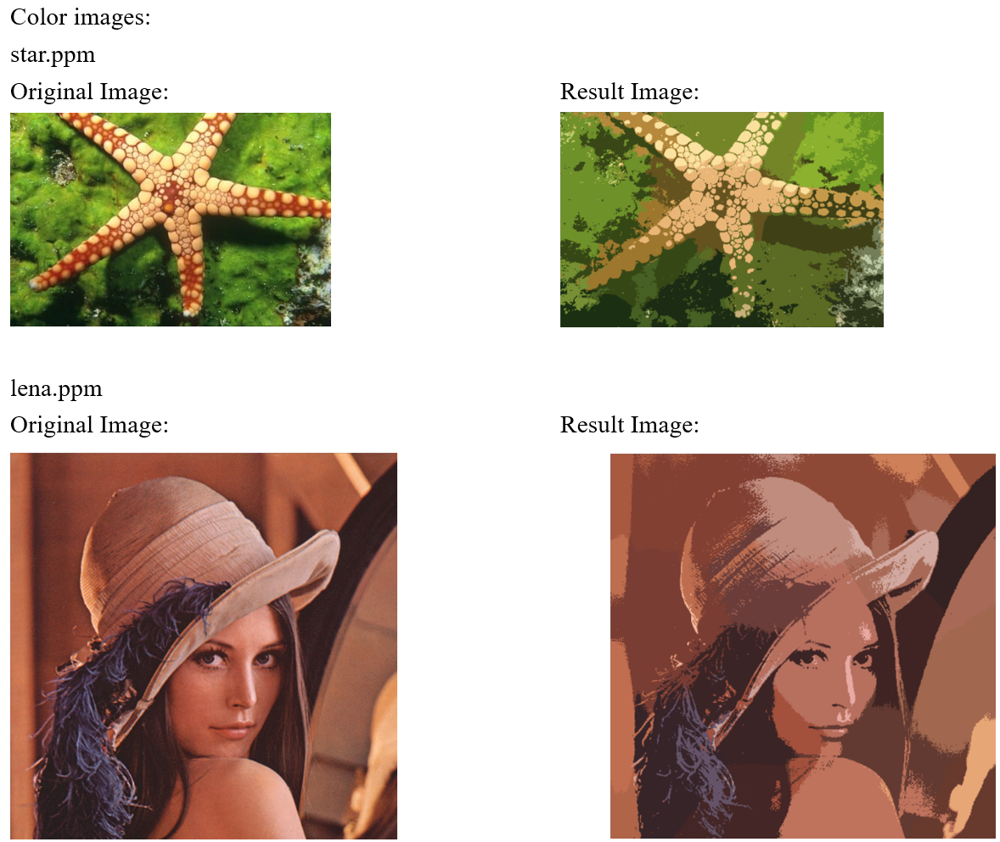
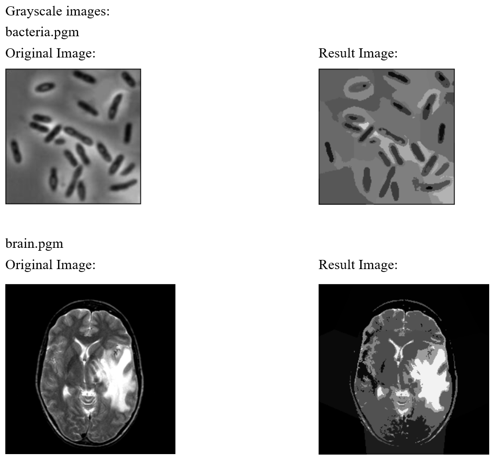

# K-Means++ Algorithm

## 1. About This Project
The objective of this project is to implement a segmentation program based on K-means. The program assigns to each pixel in the image a unique label corresponding to its class.

## 2. Brief Problem Definition
In this project, an image segmentation program is implemented on the .ppm image and .pgm image. To implement image segmentation, the program allows the user to input some information including the name of the image, the image type, and the number of clusters. The program also allows the selection of the features to use for clustering.

## 3. Summary Of Choices Made For The Solution
To implement the K-means algorithm, I mainly use the following two steps:

### The choice of initial cluster centers:
The choice of initial cluster centers is based on the K-means++ algorithm.
The basic idea of selecting the initial cluster centers is that the distance between the initial cluster centers should be as far as possible.
The algorithm is described as follows:

### Iteration:

## 4. Segmentation Results Of 2 Color And 2 Gray Scale Images

## 5. Brief Discussion Of Results
### Program Description: 
This program can implement image segmentation based on color, grayscale, and location and allow users to set color mode and threshold. Only the given image format which are .pgm and .ppm is allowed in this program.

### Advantages: 
K-means algorithm is simple and easy to implement. What’s more, compared to the classical K-means algorithm, this program uses the K-means++ algorithm to select initial cluster centers. This approach can keep cluster centers as far as possible and improve the quality of processed image.

### Disadvantages: 
The cluster centers may converge to the local minimum (sensitive to the selection of the initial K
clustering centers). The convergence is slow on large images.
