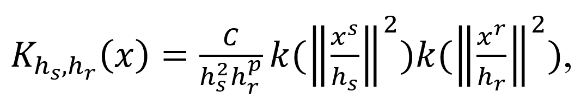
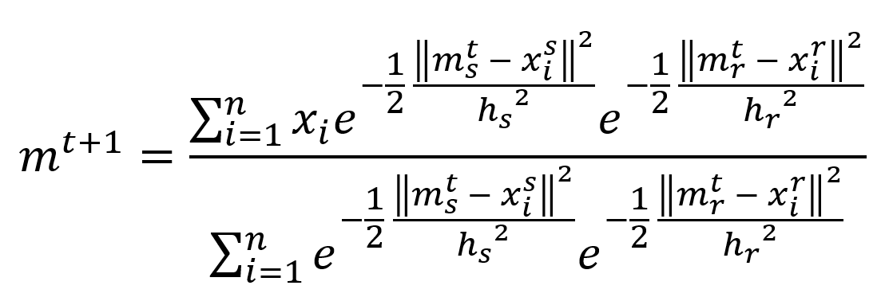
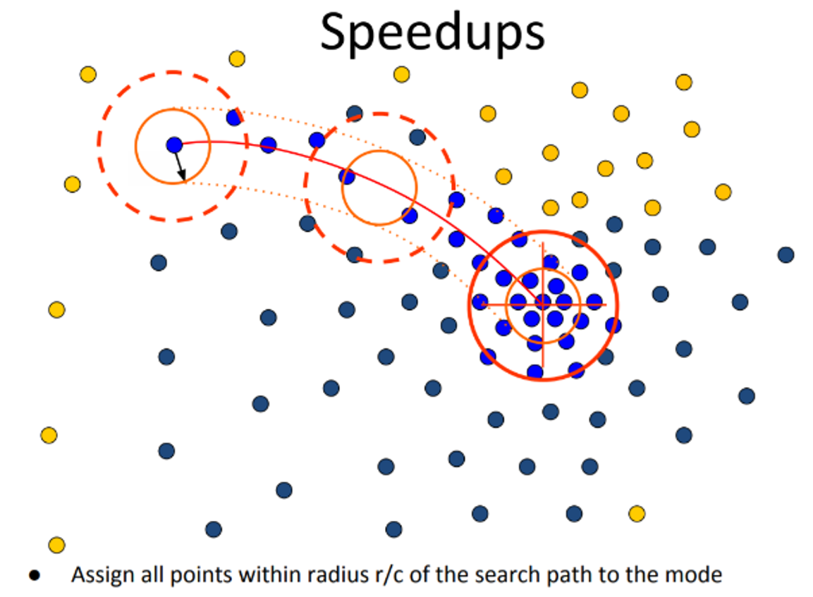
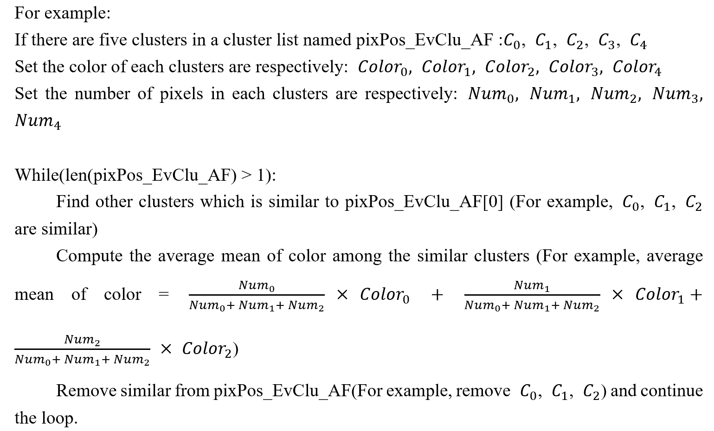
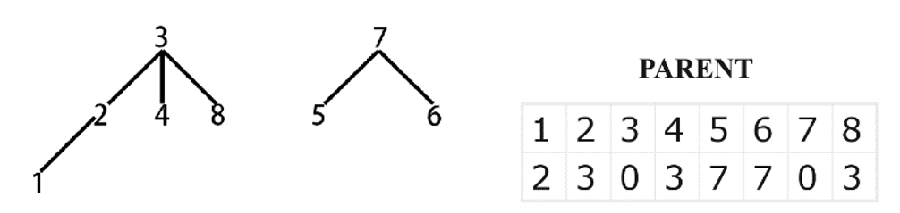
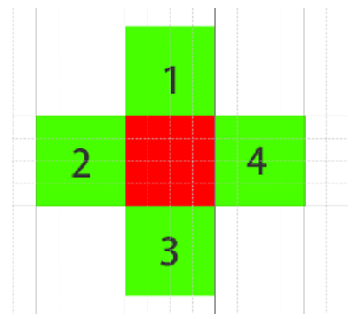
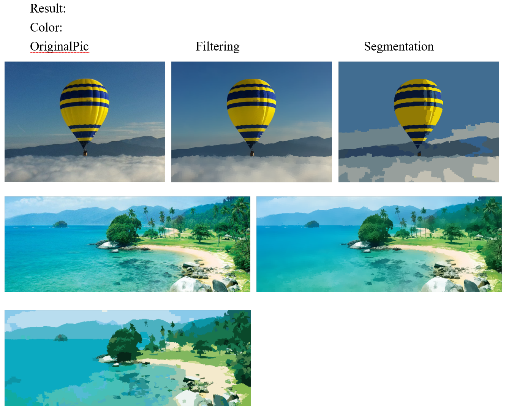
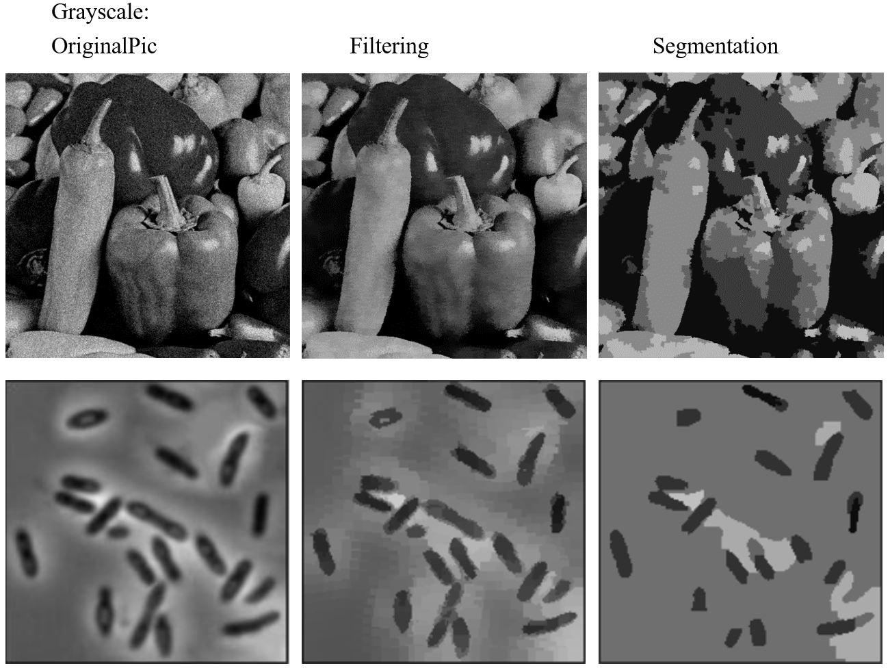

# Mean Shift Segmentation

## 1. Brief Problem Definition
In this project, the Mean Shift technique with image segmentation is implemented and the experiment is conducted to verify the effectiveness of this algorithm. Mean shift is a non-parametric feature-space analysis technique that assigns the data points to the clusters iteratively by shifting points toward the mode. For the image segmentation problem, the pixel can be mapped to the color feature space. After that, the algorithm iteratively assigns each pixel to the closest cluster centroid according to the surrounding pixels. 

## 2. Summary of Choices Made for the Solution
In this project, the algorithm consists of 3 steps for each iteration which are mean shift filtering, merging similar clusters, and eliminating Small Regions.

### 2.1 Mean Shift Filtering
Mean shift filtering is used to find the closet cluster centroid for each pixel and replace the color of the pixel with the color of the cluster center to smooth the image.
In this experiment, the Gaussian kernel function to implement mean shift filtering is used for mean shift filtering. 
The multivariate kernel can be defined as the product of two radially symmetric kernels with two bandwidth parameters for each domain. Here is the form of the Gaussian kernel function:

where x^s is the spatial part, x^r is the color or grayscale part of a feature vector, k(x) is the common profile used in both domains, h_s, and h_r are the employed bandwidth, and C is the corresponding normalization constant. For .ppm image, filtering is in 5D feature space, two for lattice coordinates and three for RGB color. For .pgm image, filtering is in 3D feature space, two for lattice coordinates and one for grayscale.
The new cluster centroid can be computed as:

Where m^t is the current cluster centroid, m^(t+1) is the new cluster centroid, h_s is the bandwidth of space, and h_r is the bandwidth for color or grayscale. x_i is the feature vector of pixels that are computed in current mean shift filtering.

In mean shift filtering, every pixel in the image will be scanned. However, it is time-consuming.
To speed up the process of mean shift filtering, two circles (rectangles in the program) are used. The peripheral circle encircles the pixels to be computed in mean shift filtering. The inner circle encircles pixels that will be optimized, that is those optimized pixels will be regarded as the cluster center and will never be scanned.
When completing the mean shift filtering, we will get some clusters, and in each cluster pixel colors are the same. The pixel positions of each cluster will be stored in the list pixPos_EvClu_AF.

### 2.2 Merge Similar Clusters
Merging similar clusters is used to merge some clusters that are similar according to the color (or grayscale) and the coordinates of the clusters.
The criterion for merging similar clusters is based on the shortest distance in space dimension and distance in color (or grayscale) dimension between two clusters. If the shortest distance in space dimension is less than or equal to one threshold and the color (or grayscale) distance is less than another threshold. Then merge the clusters.

### 2.3 Eliminate Small Regions
Eliminating small regions is used to avoid over-segmentation. Small clusters would be assigned to big clusters.
There are two steps to eliminate small regions:

①	Use row-by-row methods and union-find structure to merge pixels of similar color (or grayscale) row by row (like assignment 1). And regenerate the new clusters.

②	Set a threshold and regroup new clusters into two groups based on the pixel number of clusters. 

In step ①：

Like the connected component labeling algorithm, scan the pixels row by row to find pixels of which distances of color (or grayscale) space between those pixels are less than a specific threshold. 
We use an array named ‘parent’ to store sets of equivalent labels in a tree. In the ‘parent’ array, the subscripts are possible labels and values are the labels of ‘parent’ nodes.

About the union-find there are two functions which are Find and ‘Union’. The ‘Find’ function utilizing the ‘parent’ array, searches the root of one label and returns the root. The ‘Union’ function merges two sets containing the given label x and given label y and then modifies the ‘parent’ array.

Use img_Label (2d array with shape rowNum × colNum) to mark pixel labels and  Use union-find to connect pixels based on labels.
After connected component labeling, there will be several new clusters with same label and same color.

In step ②：

After step ① there are some new clusters (For example C_0, C_1, C_2, C_3, C_4), I divide those clusters based on the number of pixels into two groups. The largeClu_Pos in which the pixel number of each cluster is greater than 30 (For example C_0, C_1); The smallClu_Pos in which the pixel number of each cluster is less than 30 (For example C_2, C_3, C_4)

Then create a 2d array named img_MarkSmallClu to mark which pixels are in large clusters and which pixels are in small clusters. If one pixel with coordinate (0, 1) is in a small cluster, then img_MarkSmallClu[0, 1] = 1, otherwise img_MarkSmallClu[0, 1] = 0

To assign color to each small cluster, firstly compute the peripheral pixels of each small cluster. Then based on the peripheral pixels of each small cluster, find if one of the peripheral pixels is in a large cluster. If so, assign the color of the first-found large cluster to the corresponding small cluster.

For example, if there is a small cluster that has just one pixel(red one). We get it’s peripheral pixels(green pixels 1, 2, 3, 4). Then we use loop search for each peripheral pixel to find if one peripheral pixel is in a large cluster. If so, we assign the color of the first-found large cluster to the small cluster and exit the loop.

## 3. Segmentation Results Of 2 Color And 2 Gray Scale Images

## 4. Brief Discussion Of Results
The following are some advantages of the Mean-Shift clustering algorithm:
1.	It does not need to make any model assumption as in K-means or Gaussian mixture.
2.	It can also model the complex clusters which have nonconvex shapes.
3.	It only needs one parameter named bandwidth which automatically determines the number of clusters.
4.	There is no issue of local minima as in K-means.
5.	No problem generated from outliers.

The following are some disadvantages of the Mean-Shift clustering algorithm:
1.	The effectiveness of this algorithm is not good enough which is time-consuming.
2.	Cannot have any direct control over the number of clusters but in some applications, we need a specific number of clusters.
3.	It cannot differentiate between meaningful and meaningless modes.

## 5. Other Examples

